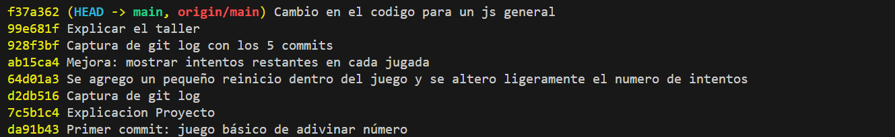

# Taller Git + GitHub

**Autor:** Diego Alejandro Vàsquez Sànchez

Este repositorio contiene el taller de Git y GitHub.  
Contiene un videojuego en donde el jugador debe adivinar un número secreto, recibiendo pistas de frio o caliente para saber que tan cerca  lejos esta de encontrarlo y tiene ademas de eso un límite de intentos, una funcion para poder volver a jugar y mejora en manesajes a nivel general.

## Captura del historial de commits

